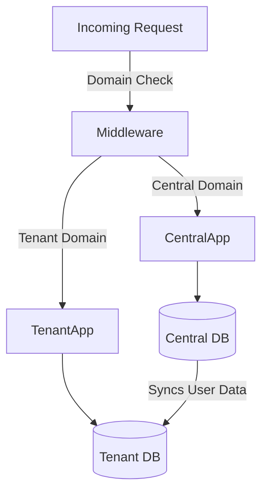

# Architecture Overview

Condica is built on **Laravel 12** and leverages a multi-tenant architecture to serve multiple organizations (tenants) from a single codebase while keeping their data isolated.

## Multi-Tenancy

We use [stancl/tenancy](https://tenancyforlaravel.com/) v3 to implement multi-tenancy.

### Strategy: Database per Tenant
Each tenant has its own separate database. This ensures:
-   **Data Isolation:** Strict separation of data between tenants.
-   **Security:** Reduced risk of data leakage.
-   **Scalability:** Easier to shard or move specific tenants to dedicated database servers if needed.

### Tenant Identification
Tenants are identified by **Domain** or **Subdomain**.
-   **Central Application:** Hosted on `central_domain.com` (configured via `CENTRAL_DOMAINS` in `.env`). Handles landing pages, global admin panel, and tenant registration.
-   **Tenant Application:** Hosted on `tenant_id.central_domain.com` or a custom domain `tenant-domain.com`.

### Bootstrapping
When a request comes in for a tenant domain:
1.  The middleware identifies the tenant.
2.  The application switches the default database connection to the tenant's database.
3.  Cache, Filesystem, and Queues are scoped to the current tenant.

## Admin Panel

The administration interface is built using **[Backpack for Laravel](https://backpackforlaravel.com/)**.

-   **Theme:** Tabler (Bootstrap 5 based).
-   **CRUDs:** We use Backpack's CRUD operations to manage resources like Tenants, Users, Roles, and Permissions.
-   **Access:** The admin panel is primarily for the **Super Admin** (on the central domain) to manage tenants. Tenants may have their own dashboard in the future.

## Authentication & Authorization

### Authentication
-   **Web:** Standard Laravel session-based authentication.
-   **API:** [Laravel Sanctum](https://laravel.com/docs/sanctum) for token-based authentication (Mobile Apps / External Integrations).
-   **Admin Panel:** Uses a custom `backpack` guard, but integrates with the standard `users` table.

### Authorization (RBAC)
We use [Spatie Permission](https://spatie.be/docs/laravel-permission/v5/introduction) integrated via Backpack Permission Manager.
-   **Roles & Permissions:** defined in the database.
-   **Scope:**
    -   **Central Context:** Roles/Permissions apply to the global management.
    -   **Tenant Context:** Each tenant has its own `roles` and `permissions` tables. A user can be an "Admin" in Tenant A but a regular "User" in Tenant B.

## User Management Architecture

We use a "Synced Resource" pattern for users.

1.  **Central User (`App\Models\CentralUser`):** Lives in the central database. Represents the global identity of the person.
2.  **Tenant User (`App\Models\User`):** Lives in the tenant database. Represents the user's membership in that specific tenant.
3.  **Syncing:** When a user is assigned to a tenant, their basic info (name, email, password) is synced from Central -> Tenant.
    -   *Note:* Updates to the central profile propagate to tenant profiles.

### Data Flow

